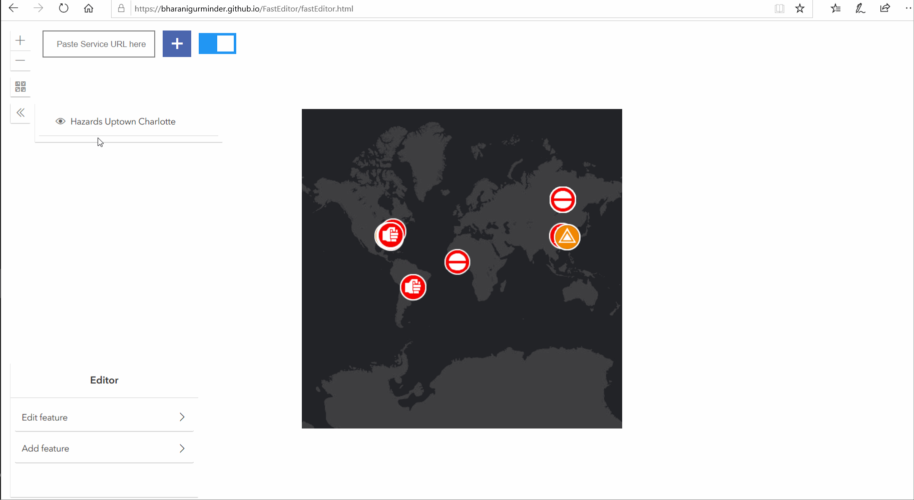

# FastEditor
Digitize your GIS data faster

First you will need to get the REST end URL for the ESRI Feature Service URL, for this example I am using sampleserver6's wildfire FeatureServer
Using the layerlist widget you can choose the layer you want to edit

You can change the basemap using basemap gallery widget 

How to enable and disable autopan

